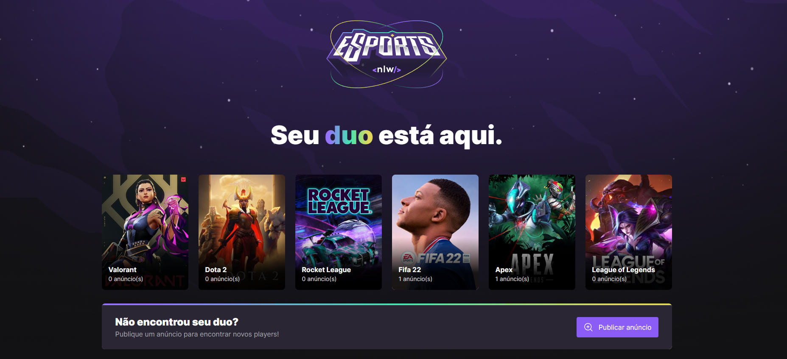
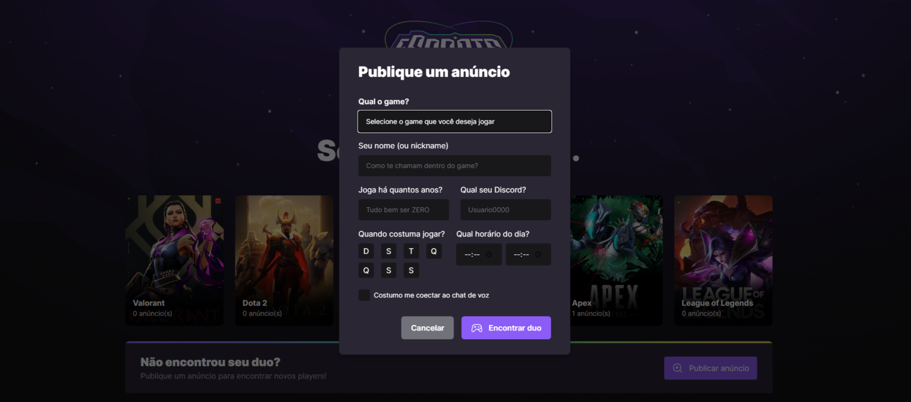

<h1 align="center">

</h1>
<h1 align="center">NLW eSports | Ignite - Rocketseat 🚀</h1>

<p align="center">
<a href="#Sobre">Sobre</a> |
<a href="#Layout">Layout</a> |
<a href="#Tecnologias">Tecnologias</a> |
<a href="#Infos">Infos</a> |
<a href="#ultilizar">Como ultilizar</a> |
</p>

<h2 id="Sobre">💻 Sobre</h2>
<p>NLW eSports - É uma aplicação WEB para ajudar os players a encontrarem parceiros para jogarem juntos. O projeto conta com uma lista de games predefinida. Em cada um deles é possível ver os anúncios de outros usuários buscando parceiros, e ainda é possível criar um anúncio para buscar novos colegas de game.</p>
<br>

<h2 id="Layout">🎨 Layout</h2>
<p>Veja o Layout da aplicação a seguir</p>

<h1 align="center">

</h1>
<h1 align="center">

</h1>

<h2 id="Tecnologia">🛠 Tecnologias</h2>
<p>As seguintes tecnologias foram empregadas na criação deste projeto:</p>

-[ReactJs](https://reactjs.org/)
-[Node.js](https://nodejs.org/en/)
-[Tailwindcss](https://tailwindcss.com/)
-[Javascript](https://developer.mozilla.org/pt-BR/docs/Web/JavaScript)
-[Typescript](https://www.typescriptlang.org/)
-[Radix UI](https://www.radix-ui.com/)
-[Phosphoricons](https://phosphoricons.com/)
-[Prisma ORM](https://www.prisma.io//)
-[Vite](https://vitejs.dev/)

<h2 id="Infos">🚀 Infos</h2>
<p>Este projeto é composto por 2 partes distintas:</p>
<br>
<p>1. Backend (server)</p>
<p>2. Frontend (web)</p>

<h2 id="ultilizar">🚀 Como utilizar</h2>
<p>💡O Frontend precisa que o Backend esteja em execução para funcionar.</p>
<h3>Pré-requisitos</h3>
<p>É recomendado que você tenha instalado em sua máquina as seguintes ferramentas:<a href="https://git-scm.com/">Git</a>, <a href="https://nodejs.org/en/">Node.js</a>. Além disso é bom ter um editor para trabalhar com o código como o <a href="https://code.visualstudio.com/">VScode</a>.</p>
<h4>⚙️ Executando o Backend (server)</h4>

```bash
# Clone o projeto para o local desejado em seu computador.
$ git clone git@github.com:Piresives/nlwEsports.git

# Entre no diretório do BackEnd
$ cd NLW-eSports-Ignite/server

#Instale as dependências necessárias
$ npm install

# Inicie a aplicação
$ npm run dev

# Confira se o servidor está em execução. Você deverá receber a seguinte mensagem no terminal:
$ Server is running on Port 3333
```

<h4>💻 Executando o Frontend Web (web)</h4>

```bash
# Entre no diretório do Frontend Web
$ cd NLW-eSports-Ignite/web

# Instale as dependências necessárias
$ npm install

# Inicie a aplicação
$ npm run dev

# Confira se o servidor está em execução e abra ele no seu navegador preferido. Por padrão, o endereço de execução deverá ser esse:
$ http://localhost:5173/  
```

Made with 💚 by Ives Pires 👋 [See my LinkedIn](https://www.linkedin.com/in/ives-pires-de-miranda/)

